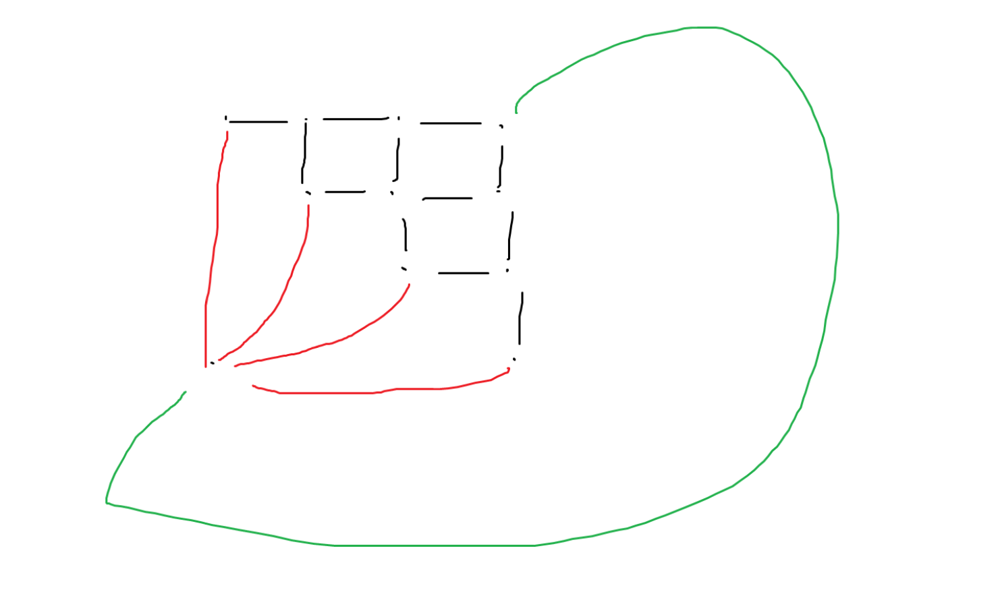

# [2020牛客暑期多校第二场](https://ac.nowcoder.com/acm/contest/5667)

## **A**

**upsolved by JJLeo**

### 题意

给定$n$个字符串，设$x$是最大的使$s_i$长度为$x$的前缀和$s_j$长度为$x$的后缀相等的数，有$f(s_i,s_j)=x$，求$\sum_{i=1}^n \sum_{j=1}^n {f^2(s_i,s_j)} \pmod {998244353}$。$(1 \le n \le 10^5, 1 \le \sum |s_i| \le 10^6)$

### 题解

考虑每个前缀有多少个后缀和它相等，可以用广义后缀自动机，也可以把哈希开到$\text{long long}$用$\text{unordered_map}$过。但这样直接算会算重，考虑去重：求出每个字符串的$\operatorname{next}$数组，则将$\operatorname{cnt}[\operatorname{next}[i]]$减去$\operatorname{cnt}[i]$即可。

## **B**

**solved by 2sozx**

### 题意

给定平面上 $n$ 个点，问最多有多少个点与圆点共同在一个圆上。$n \le 2000$

### 题解

我们枚举其中的两个点，设两个点的坐标为 $(x_1,y_1),(x_2,y_2)$ ，则这两个点和圆点所确定的圆的圆心为 $$(\frac{y_1y_2^2-y_2y_1^2+y_1x_2^2-y_2x_1^2}{2(x_2y_1-x_1y_2)},\frac{x_1y_2^2-x_2y_1^2+x_1x_2^2-x_2x_1^2}{2(x_1y_2-x_2y_1)})$$ 之后根据我们的枚举方法，每个圆心所能被统计到的次数 $T$ 和圆上的点数 $x$ 有 $T=\frac{x(x-1)}{2}$，最后取 $\max$ 即可

## **C**

**solved by JJLeo**

### 题意

给定一棵树，求最少需要多少条链才能覆盖所有边，可重复覆盖。

### 题解

类似找重心的方式，叶节点权值为$1$，非叶节点权值为$0$，找到一个点使得以其为根则每个儿子所在子树的叶子节点都不超过总叶子节点的一半。维护一个大根堆，每次剩余找叶子节点最多的两个子树拉两个叶子节点进行配对，如果奇数个叶子节点多余的一个和根节点配对即可。

## **D**

**solved by 2oszx**

### 题意

签到

### 题解

签到

## **E**

**upsolved by JJLeo**

### 题意

给出一些$n$个值$a_1,a_2, \cdots , a_n$，问可重复地挑选$1,2,3, \cdots n$个值异或和的最大值。$(1 \le n \le 2 \times 10^5, 0 \le a_i < 2^{18})$

### 题解

设可重复选$i$个元素的最大值为$b_i$，可以证明当$n > 19$后有$b_i=b_{i-2}$。证明如下，首先显然有$b_i \ge b_{i-2}$，选两个一样的即可；其次假设$b_i > b_{i-2}$，则说明$i-2$个元素并不能达到最大值，即并不能达到满秩，因此至少$i-1$个元素才能达到满秩，当$n > 19$至少$19$个元素才能满秩，然而由数据范围可以知道秩最大为$18$，矛盾，因此假设不成立，有$b_i \le b_{i-2}$。综上可得$b_i=b_{i-2}$。因此我们将可以得到的值对应下标设为$1$，然后$\text{FWT}$卷积$19$次，然后每次将不为$0$的项改为$1$即可。

## **F**

**solved by Bazoka13**

### 题意

$A[i][j]$的值是$lcm(i,j)$，求所有$k*k$子矩阵里最大值的和。

### 题解

对行对列单调队列处理就好了

## **G**

**upsolved by JJLeo**

### 题意

字符串匹配。字符集为正整数，要求模式串每一位都小于等于文本串，文本串长度为$n$，模式串长度为$m$。$(1 \le n \le 150000, 1 \le m \le \min\{n, 40000\})$

### 题解

$\text{Shift-And}$算法。考虑如何构造出辅助表，即模式串的每一位能否匹配文本串的每一位。只需从小到大将两个串排序，然后从小到大扫一遍将对应的位从$0$改为$1$即可。然而这样空间复杂度为$O(\dfrac{nm}{w})$会$\text{MLE}$，事实可以发现本质只有$m$种不同的$\text{bitset}$，将每一位和每个$\text{bitset}$进行一下对应即可，空间复杂度降为$O(\dfrac{m^2}{w})$，时间复杂度为$O(\dfrac{nm}{w})$。

## **H**

**solved by 2sozx**

### 题意

给定一个 $multiset$ ，起始为空，有三种操作，前两种是插入删除，第三种是查询 $x$ 问集合中是否有两个元素 $a,b$ 使得 $a,b,x$ 构成三角形。$q \le 2 \times 10^5,x \le 10^9$

### 题解

我们先考虑查询。
  * $x > \max(a,b)$ 时，我们可以通过 $multiset$ 查询小于等于 $x$ 的最大两个元素是否能够与 $x$ 构成三角形即可。
  * $\min(a,b) < x < \max(a,b)$ 时，也可以通过 $multiset$ 查询小于 $x$ 的最大元素和大于 $x$ 的最小元素即可。
  * $x < \min(a,b)$ 时，我们即为查询是否存在相邻的 $a,b$ 使得 $x < |a-b|$ ，这个可以通过权值线段树进行取 $\min$ 操作即可。

由于权值为 $1\sim10^9$ 因此我们需要动态开点。

## **I**

**upsolved by JJLeo**

### 题意

区间$[l,r]$可以变成$[l-1,r],[l+1,r],[l,r-1],[l,r+1]$，现在有$m$个方案可以让你花费$c$禁止掉两个不同区间之间的双向变换，求最小代价使得$[1,n]$无法变成$l=r$的区间，或判断无解。$(2 \le n \le 500, 0 \le m \le n(n-1))$

### 题解

题目可以转化成如下的平面图，所有有限制的边长度为花费，无限制的边长度为正无穷，转对偶图求最短路即可。

{{:2020-2021:teams:farmer_john:jjleo:2020now2i.png?800|}}

## **J**

**solved by JJLeo**

### 题意

给出一个目标排列$a$，长度为$n$，大质数$k$，现在求一个置换使得$1,2, \cdots ,n$经过$k$次变换成为$a$，或判断无解。$(1 \le n \le 10^5, 10^8 \le k \le 10^9)$

### 题解

考虑把每个环单独拿出来看，设环长为$l$，$m = k \mod l$，则相当于已知每个点的前$m$个点是哪个点，依据这个将对应置换推出来即可。无解条件为$l \mod m = 0$且$m \ne 1$。

## **K**

**upsolved by JJLeo**

### 题意

给出三个同心圆，三个点各自等概率地分布在三个圆上，求三点形成三角形的期望面积。保留一位小数，保证第二位小数既不是$4$也不是$5$。

### 题解

<del>最关键的后半段话没看到....</del>题目明示精度要求很低，固定一个点，双重循环将$[0,2\pi]$均匀分为$500$份，暴力枚举另外两个点的分布直接计算，计算三角形面积用叉乘取绝对值即可。

## **记录**

10min:MJX 慢人一步发现 D 题签到，AC，ZYF 冲H 
28min:ZYF WA2 后 MJX 冲 B 
62min:MJX WA3 T1 后和 ZYF 讨论C 后开始冲 C，CSK 接手 B 
93min:B C 相继挂7次后 CSK冲 F 
104min:CSK AC，继续冲B C 
141min:ZYF AC C，之后又是漫长的思考时间 
210min:MJX 发现 H 之前的错误情况可做，冲 H 挂了，和ZYF 冲J 
221min:ZYF AC J 
224min:MJX AC H,之后一起冲 B 
250min:挂14次后终于冲破了 B，之后分别看 EG 
after:ZYF 半天补完了剩下的题，ZYF YYDS!

## **总结**

  * ZYF要避免自己把自己绕晕，同时加强对学过知识的熟练程度，例如$\text{Shift-And}$和$\text{FWT}$学过却完全想不起来。
  * MJX要加快自己读题速度以及写签到题的速度，开始和别人差了一截。
  * CSK不能上头，及时调整思路，注意沟通