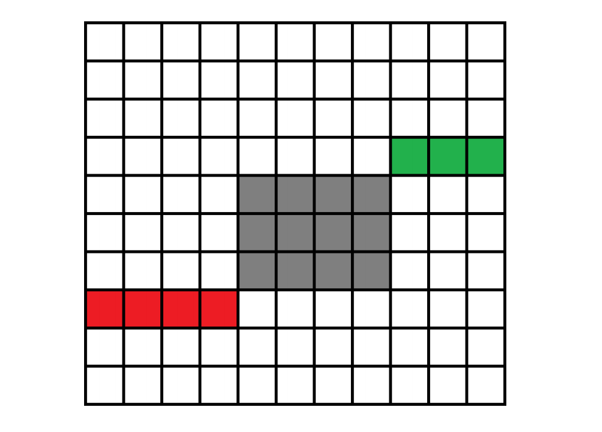

# [2020HDU暑期多校第二场](https://codeforces.com/gym/288624)

| 排名 | 当场过题数 | 至今过题数 | 总题数 |
| ---- | ---------- | ---------- | ------ |
| N/A  | 6          | 11         | 12     |

## **A**

**solved by 2sozx**

### 题意

给定一个无向图，每个点有个权值 $b_i$ ，每次操作可以选择一个连通块并且将这个连通块所有点的 $b_i-1$，问最少要操作几次使得$b_i=0(i=1,2\cdots n)$。$(n\le10^5,m\le2\cdot10^5)$ 

### 题解

暴力的思路很好想，每次选择一个不包含 $b_i=0$ 的最大连通块，然后将这个连通块所有 $b_i-1$即可，显然会超时。

我们考虑将 $b_i$ 从大到小排序，对于扫到的点我们只考虑比当前枚举的 $b_i$ 大的点。先将 $b_i$ 加入答案，如果此时不在一个联通块中将其合并，并且可以从答案中减去 $b_i$，因为在考虑过这个点之后比他大的点就可以少操作 $b_i$ 次，用并查集维护联通即可。

## **B**

**upsolved by **

### 题意

### 题解

## **C**

**upsolved by **

### 题意

### 题解

## **D**

**upsolved by JJLeo**

### 题意

给定一个$n \times n$的方格图，每次只能向右向下走，要从左上角走到右下角。每个方格有一个权值$a_{i,j}$，路径上每经过一个点就会获得${(n^2)}^{a_{i,j}}$的权值。现在有$q$次询问，询问若一个矩形区域不可通过，所有合法路径中的最大权值对$10^9+7$取模。$(n \le 400, q \le 2 \times 10^5)$

### 题解

如图所示，设灰色区域为被禁止通过的区域，那么所有合法路径一定至少经过了一个红色格子或绿色格子，同时至少经过了一个红色格子或绿色格子的路径也是合法的。因此可以求出每个点分别到起点和终点的最大权值，求一下每一行的前缀后缀最大值即可。

然而cls并没有让这题就这样结束，可以发现权值太大没有办法直接维护。观察权值的底数可以发现我们可以将权值和写成$n^2$进制，这样权值相加可以保证不会发生进位，从而将比较大小改为比较两个字符串的字典序。每次转移中相当于在某一位加了个$1$，因此我们可以用主席树维护每个权值，比较大小时维护区间哈希值，在线段树上二分最长公共前缀，最终比较第一位不同的而得出大小关系。另外因为我们要维护每个点分别到起点和终点的最大值，最终求每一行的最大值前后缀需要进行加法，因为两者相加的哈希值等于两者的哈希值相加，所以直接将两棵树放一起进行比较即可。

## **E**

**solved by JJLeo**

### 题意

$n$个人，$m$个机器，第$i$个人找第$j$个机器权值为$a_ij^2+b_ij+c_i$，现在问匹配$1,2,\cdots ,n$个人的最小收益都是多少。$(n \le 50, m \le 10^9,a_i > 0, {b_i}^2-4a_ic_i \le 0)$

### 题解

找二次函数顶点，周围扩一定量的点，肯定是最优的，但是不能一个扩$n$个不然$O(n^5)$会炸的。然后乱搞一波套EK就过了。

## **F**

**solved by Bazoka13**

### 题意

给定两个按照斐波那契表示法的a,b,从a*b的结果中删去斐波那契数列的一项，询问删除的第几项。

### 题解

显然有$a*b=c+f[k]$，那么在模意义下找到等于$a*b-c$的那项即可，因为担心同余所以取双模，记得不要乱开ll

## **G**

**upsolved by JJLeo**

### 题意

给出一个$n$个节点的树，每条边有两个权值$a_i$和$b_i$，现在可以让恰好$k$条边为$a_i$，其它边为$b_i$，问最小直径是多少。$(n \le 2 \times 10^4, k\le 20)$

### 题解

先二分直径长度，然后设$f_{i,j}$为以$i$为根的子树中有$j$条边选择$a_i$时所有链长度都不超过二分的长度，满足上述条件的所有方案中以$i$为端点的最长链的最小值。合并时只要两者之和不超过二分的长度即可合并，初始值$f_{i,0}$设为$0$，其它全部设为正无穷即可。可以发现这就是个树形背包，因此上下界优化后复杂度为$O(nk)$，再加上二分的总复杂度为$O(nk\log n)$。（但是还是被卡常卡吐了，比标程慢了一倍多，cls，卡常的神！）

## **H**

**upsolved by JJLeo**

### 题意

一开始有$n$个形如$f_i(x)=(x-a_i)+b_i$的函数，$m$次操作，每次可以添加一个形如上述的函数，或删除一个函数，或询问当$x=x_0$时现存所有函数的最小值。$(n, m \le 10^5)$

### 题解

考虑函数不增不删只有数次询问的情况，可以发现这些函数都是$f(x)=x^4$进行平移得来，两两只会相交一次并在此处改变大小关系，因此可以类似决策单调性dp中的二分栈，维护出每个区间的最优函数，对于每个询问只需二分找到对应区间即可获得答案。但本题有函数的增删，因此可以再套一个线段树分治，对每一层都来一次上述过程，处理区间中所有的询问，而每个询问只需取最小值即可。这样每个询问被处理$O(\log n)$次，每个函数被处理$O(\log n)$次，总复杂度$O(n \log ^2 n)$。（一开始把所有函数和询问全在叶子节点处理，直接白分治了）

## **I**

**upsolved by **

### 题意

### 题解

## **J**

**solved by JJLeo**

### 题意

爆搜。

### 题解

注意如果爆搜过程中有一些层是空的，一定要在搜之前就删掉，否则复杂度会多乘一个$n$，瞬间爆炸。

## **K**

**upsolved by **

### 题意

### 题解

## **L**

**solved by JJLeo**

### 题意

给定两个字符串$s$和$t$，$q$次询问$s$一个子串和$t$的距离。字符串的距离定义为每次操作可以选择两个字符串之一，删除任意一个字符，或在任意位置添加一个字符，最少的次数将两个字符串变为一样。$(|s|,q \le 10^5, |t| \le 20)$

### 题解

距离本质就是两者长度减去两倍的最长公共子序列长度。因此本题就是求$s$的子串和$t$的最长公共子序列，因为$t$长度很小，可以设$f_{i,j}$为匹配到$t$的第$i$位，此前有$j$位匹配时$s$最靠前的匹配点。只需预处理出$s$中每个位置距离下一个每个字符最近的距离（子序列自动机）即可。

## **记录**

0min：分题，又没找到签到题 
38min：ZYF冲J暴搜，T2后AC，CSK冲F 
78min：CSK T2,WA3后AC，MJX冲A 
104min：MJX WA1后AC 
144min：ZYF WA1后AC，MJX ZYF 冲E 
227min：N WA后AC，CSK冲I 
287min：N RE后AC 
till end：G被卡常了，cls为啥能跑那么快 

## **总结**

  * MJX：并查集合并出问题，太离谱了。
  * ZYF：感觉低级错误太多，码力不够，WA了无数次，浪费了大好时光。最后G写对了可惜被卡常了。
  * CSK：不开ll见祖宗，乱开ll见祖宗