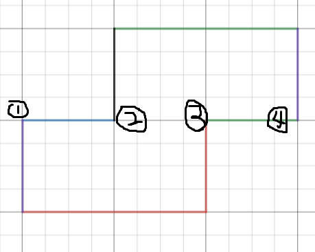
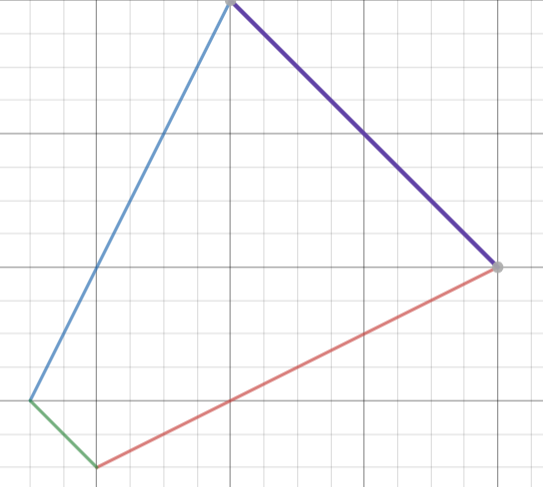

# [2020-2021 BUAA ICPC Team Supplementary Training 02](https://codeforces.com/group/azDPdoF24f/contest/290092)

| 排名 | 当场过题数 | 至今过题数 | 总题数 |
| ---- | ---------- | ---------- | ------ |
| 6/19 | 6          | 8          | 10     |

## **A**

**solved by JJLeo**

### 题意

给定一个长度为奇数的序列，每次对一个区间进行升序排序或降序排序，问最后中间的数是啥。

### 题解

二分答案，然后将其它数字与他的大小关系变成$0$或$1$，使用线段树对$01$进行排序，最后看中间位置的数是否满足条件即可。

## **B**

**upsolved by **

### 题意

### 题解

## **C**

**solved by Bazoka13**

### 题意

一个2000*2000的矩阵，给定$n$条线段，询问这些线段一共经过多少个格子

### 题解

枚举横坐标，计算纵坐标然后染色即可

## **D**

**upsolved by JJLeo**

### 题意

给定一棵$n$个节点的树，每次等概率地选择一个节点，获得该节点所在连通块大小的权值，然后删除这个节点及其相连的边，重复$n$次操作，求期望权值。$(n \le 10^5)$

### 题解

考虑两个点$u,v$之间的贡献，只有当$u$到$v$路径上$v$是第一个删除的点，$v$才能对$u$产生$1$的贡献，设路径长度为$d$，则概率为$\dfrac{1}{d+1}$。因此答案转化为树上不同长度的路径各有多少条，其中长度为$0$的路径（即自己对自己的贡献）只用算一遍，长度大于$0$的路径要算两边（两者对互相都有贡献）。

具体做法为淀粉质+FFT，如果对于某一个分治中心，一个子树一个子树合并，很容易就被菊花图+一条超长链卡出TLE。因此需要使用容斥的思想，将所有子树的的贡献全部加在一起，只做一次FFT，这样会多算出每个子树内部自己和自己合并出来的答案，只需要处理每个子树过程中，将其内部的贡献做一次FFT减掉即可。这样FFT多项式的总长度是$O(n\log n)$的，因此总复杂度为$O(n\log^2 n)$。

## **E**

**upsolved by **

### 题意

### 题解

## **F**

**solved by Bazoka13**

### 题意

给定一个集合，每个元素都有相应权值，求权值和第$k$小的子集

### 题解

利用优先队列，每次取出最小的元素后将最贵的换成更贵的或者直接加入更贵的

## **G**

**upsolved by **

### 题意

### 题解

## **H**

**solved by 2sozx **

### 题意

给定一个第一象限简单多边形，问一条从原点出发的直线最多将多边形分成多少块。$n\le10^5$

### 题解

首先忽略掉三点共线的点，这样的点是没有意义的，之后对剩余的点进行极角排序，让直线逆时针扫这些点，将这些点分成四种情况。

在扫到 $1,2$ 类点的时候块数会直接减一加一；扫到 $3,4$ 类点的时候继续移动块数会减一加一，但是刚扫到的时候并不会直接改变，可以通过叉积判断这四种情况。然而样例中给了一种特殊的情况。

此时下面这条线的两个点会被一起枚举到，并且此时的直线与这条线段重合，因此我们要避免重复计数的情况，取叉积的时候只在一侧添加等号。重合时还有一种情况时没有贡献的，只要调整叉积等号的取法即可，即如果一侧被计算到了，另一侧要减去，如果一侧没被计算到，另一侧也不会被计算到。

## **I**

**solved by Bazoka13**

### 题意

每次选两个叶子节点染色，并将其路径上所有节点涂黑，进行该操作直到不存在两个路径上节点全为白色的叶子节点，求最小操作数

### 题解

显然每个子树可以拿出来一个与尽可能远的叶子节点进行配对，而剩下的叶子节点可能会存在必须进行配对的，那就可以分情况考虑
  * 如果叶子节点数为1的子树多于2，就拿出来两个配对
  * 如果叶子节点数为2的子树多于1，就拿出来一个配对
  * 如果叶子节点数为1的子树多于1并且存在叶子节点数为2的子树，就拿出来将二者配对
  * 显然剩下的叶子节点最多给父亲传递两个叶子节点

## **J**

**upsolved by JJLeo**

### 题意

给定一个$01$序列，每次操作可以将一个字符移动到任意一个位置，问$k$次操作可以得到的连续$0$的最大长度。

### 题解

最优方案一定是将一个区间里的$1$挪出去然后再把一些$0$挪进来。 
然后我就莫名其妙将$01$绑定了，然后就莫名WA 4，直接葬送这把。 
设$sum_0,sum_1$分别为$0,1$的前缀和，答案为$\min(sum_0[n],sum_0[i]-sum_0[j]+k-(sum_1[i]-sum_1[j])$，要求区间内$sum_1[i]-sum_1[j] \le k$，直接单调队列即可。

## **记录**

0min：开局分题 
10min：MJX发现C是签到冲C 
33min：MJX WA，CSK冲G 
46min：CSK AC，ZYF冲A 
55min：ZYF AC A,MJX继续冲C 
83min：MJX WA2，换CSK写C，MJX ZYF看J 
167min：J WA4，CSK冲I 
186min：CSK AC I，ZYF继续看J，MJX看H，CSK 看F 
230min：CSK WA 
232min：MJX AC H，继续看J 
285min：CSK AC F，一起看J 
295min：CSK想到了正解冲J 
till end ：CSK没写完，由于inque多开了几分钟

## **总结**

  * MJX要尽量避免精度问题
  * CSK码力不够，最后五分钟有清晰思路的题都没有写出来，要继续锻炼
  * ZYF全场梦游，J题看了三小时都没做出来，导致最后就差这一题，亏炸。下次要敢于换写法，不要沉迷于奇奇怪怪的做法。