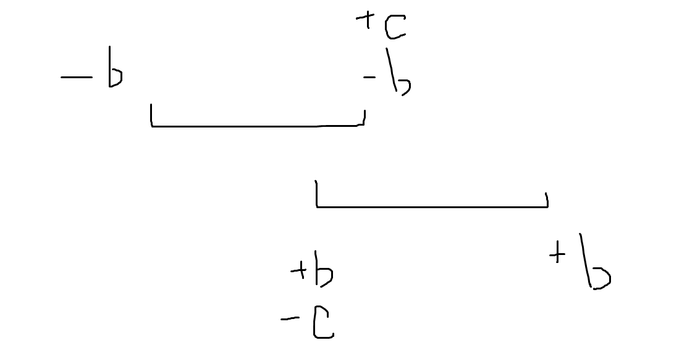

# [2017-2018 ACM-ICPC Northern Eurasia Contest (NEERC 17)](https://codeforces.com/gym/101630)

| 排名   | 当场过题数 | 至今过题数 | 总题数 |
| ------ | ---------- | ---------- | ------ |
| 72/779 | 7          | 11         | 12     |

## **A**

**solved by 2sozx JJLeo**

### 题意

$m$ 个如下两种操作之一：

- 新增一个在 $x$ 轴上方和 $x$ 轴相切的圆，给定圆心位置 $(x_i,y_i)$。
- 问 $(x_i,y_i)$ 是否被一个圆包含，是的话输出对应圆加入的时间，并删掉这个圆。

保证任意时刻任意两个圆不会重合。($1 \le n \le 2 \times 10^5$，$-10^9 \le x_i \le y_i \le 10^9$，$y_i > 0$)

### 题解

因为任意两个圆不重合且均和 $x$ 轴相切，因此对于 $x$ 轴上一个点来说，将它上面的圆从下到上必然上面一个的半径大于等于下面一个的 $2$ 倍，从而上方至多有 $O(\log y_i)$ 个圆。

因此动态开点线段树 + set 维护即可，时间复杂度为 $O\left(n \log ^2 n\right)$。

## **C**

**solved by JJLeo**

### 题意

给出一个 $n$ 个点 $m$ 条边的强连通分量，你需要删掉 $m-2n$ 条边使得它还是一个强连通分量。($n \ge 4$，$m > 2n$，$m \le 10^5$)

### 题解

建出 dfs 生成树，保留所有树边和 low 最小的返祖边即可。

正解是 Kosaraju 算法，将两次 dfs 中的树边保留即可。

## **D**

**solved by 2sozx Bazoka13**

### 题意

构建一个由数个 $1 \times 1 \times 1$ 正方体堆砌而成的立体图形满足其三视图面积分别为 $a,b,c$，或判断无解。($1 \le a, b, c \le 100$)

### 题解

不妨设 $a\le b\le c$，那么有 $b \le c \le ab$。

最小值方案即为一个横着一个斜着，最大值方案即为 $a \times b$ 的矩形。

难点在于如何输出方案，很容易就绕晕了。

## **F**

**upsolved by Bazoka13**

### 题意

### 题解

## **G**

**upsolved by JJLeo**

### 题意

现有 $n$ 个位置，以及两个长度为 $r$ 的窗口。

如果第 $i$ 个位置不被任何窗口包含，权值为 $a_i$；如果被一个窗口包含，权值为 $b_i$；如果被两个窗口包含，权值为 $c_i$。

设两个窗口的起始位置为 $x,y$ ($1 \le x < y \le n - r + 1$)，对于所有起始位置的可能情况的权值排序后，求第 $k$ 小的值。($2 \le n \le 30000$，$1 \le a_i < b_i < c_i \le 10^6$)

### 题解

首先令 $b_i$ 和 $c_i$ 减去 $a_i$，最终答案加上 $\sum \limits _{i=1}^n a_i$。

首先二分答案 $x$，计算权值和 $< x$ 的方案数。

对于两个区间不重合的情况，即为两个不相交区间 $b_i$ 的和，可以从小到大枚举其中一个，另一个离散化后用树状数组维护，随着第一个区间的移动加入或从树状数组中删除。

对于两个区间重合的情况，可以将其拆分为 $3$ 个区间和，如下图所示：

分别维护两个序列，从小到大枚举靠右的区间，类似两个区间不重合的情况维护即可。

总时间复杂度为 $O\left(n \log ^2 n\right)$。

## **H**

**upsolved by **

### 题意

关键词：给出快速幂的代码，交互题。

### 题解

## **I**

**upsolved by 2sozx Bazoka13 JJLeo**

### 题意

交互题。将 $1,2,\cdots,n$ 中奇数和偶数分别拿出来打乱，组成序列 $o_1,o_2,\cdots,o_{\lceil \frac{n}{2} \rceil}$ 和 $e_1,e_2,\cdots,e_{\lfloor \frac{n}{2} \rfloor}$。

你需要问不超过 $3 \times 10^5$ 次如下问题得到上述两个序列：

- 选择 $1 \le i \le \lceil \dfrac{n}{2} \rceil$ 和 $1 \le j \le \lfloor \dfrac{n}{2} \rfloor$，返回 $o_i$ 和 $e_j$ 的大小关系。

($1 \le n \le 10^4$)

### 题解

使用二分逐个确定奇数的位置，从而将偶数分为数个集合，集合之间大小关系已知。

随着奇数确定数量的增多，每次询问近似为二分查找，总询问次数约为 $O(n \log n)$。

一个显著的优化是假设当前问的奇数 $o_i$，此时处于偶数集合 $S_j$，不需要将 $o_i$ 和 $S_j$ 中每个元素都比较一次，只需将 $o_i$ 和 $S_{j+1}$ 和 $S_{j-1}$ 中的各一个元素进行比较即可确定二分该往哪边走。

## **J**

**upsolved by JJLeo**

### 题意

$n$ 个点 $m$ 条边的无向连通图，边带权，求 $1$ 到 $n$ 的最短路。对于一条路径，它的长度是最长的 $k$ 条边的权值和。($2 \le n \le 3000$，$1 \le m \le 3000$，$0 \le k < n$)

### 题解

先直接跑一次最短路。

再枚举最长 $k$ 条边中最短的那一条的权值 $w$，将所有边权变为 $\max(x-w,0)$，跑最短路，并将答案加上 $kw$。

对于上述所有答案取最小值即为答案。

一方面，答案一定会被上述算法所计算到，如果所选边数不到 $k$ 条会被第一次跑最短路计算，否则一定会被后续过程中某次枚举到。

另一方面，上述算法算出的解不会比真实情况更优，如果所走边数 $\le k$，显然 $+kw$ 就加多了；否则，将路径上前 $k$ 大的边全部加上 $w$，因为有些边可能原本边权 $< w$，只会得到一个比真实情况更长的路径。

总时间复杂度 $O\left(m^2 \log m\right)$。

## **K**

**upsolved by JJLeo**

### 题意

背包加密算法。私钥由 $a_1,a_2,\cdots,a_n$ 和 $r$ 组成，令 $q = 2^{64}$，满足如下条件：

- $a_i > \sum \limits _{j=1} ^ {i-1}a_j$。
- $q > \sum\limits _{i=1}^n a_i$。
- $\gcd(r,q)=1$。

公钥为 $b_1,b_2,\cdots,b_n$，其中 $b_i = a_ir \bmod q$。

加密序列为长度为 $n$ 的二进制串，其对应一个 $S \subseteq \{1,2,\cdots, n\}$，设 $s = \left(\sum \limits _{i \in S} b_i\right) \bmod q$。

给定 $b_1,b_2,\cdots,b_n$ 和 $s$，请你还原加密序列。

### 题解

当 $n \le 42$ 时，直接 meet-in-middle，暴力枚举加密序列前一半和后一半的所组成的和，两者相加要么是 $s$ 要么是 $s+q$，对这两种情况分别双指针扫即可，时间复杂度为 $O\left(2^{\frac{n}{2}}\right)$。

当 $n > 42$ 时，$a_1 < \dfrac{q}{2^n} \le 2^{21}$。因为 $\gcd(r,q)=1$，所以 $r$ 是奇数，$a_1$ 和 $b_1$ 的二进制末尾 $0$ 个数相同。设有 $z$ 个 $0$，枚举 $\dfrac{a_1}{2^z}$ 的值，有：
$$
a_1r\equiv b_1 \pmod q
$$
 从而有：
$$
\frac{a_1}{2^z}r \equiv \frac{b_1}{2^z} \pmod{\frac{q}{2^z}}
$$
此时 $\dfrac{a_1}{2^z}$ 是奇数，$\gcd\left(\dfrac{a_1}{2^z},\dfrac{q}{2^z}\right)=1$，因此可以通过扩欧求出 $\dfrac{a_1}{2^z}$ 模 $\dfrac{q}{2^z}$ 意义下的逆元，从而求出 $r \bmod \dfrac{q}{2^z}$ 的值。

这样得不到 $r$ 高 $z$ 位的信息，因此可以继续枚举 $r$ 高 $z$ 位，得到 $r$ 后就可以将 $a_1,a_2,\cdots,a_n$ 还原，并得到 $sr^{-1}=\left(\sum \limits _{i \in S} b_ir^{-1}\right) \bmod q=\left(\sum \limits _{i \in S} a_i\right)\bmod q$，因为 $q > \sum\limits _{i=1}^n a_i$，所以 $sr^{-1} = \sum \limits _{i \in S} a_i$。

根据 $a_i > \sum \limits _{j=1} ^ {i-1}a_j$ 的性质，从 $n$ 到 $1$ 依次确定每个 $a_i$ 是否被选，如果最终方案存在，且对应的 $\left(\sum \limits _{i \in S} a_ir\right) \bmod q=s$，就说明了找到了合法解。

> 为什么要再验证 $\left(\sum \limits _{i \in S} a_ir\right) \bmod q=s$，因为高 $z$ 位是枚举得出的，而 $s = \left(\sum \limits _{i \in S} b_i\right) \bmod q$ 是用到了高 $z$ 位信息的，因此不能保证一定合法。

时间复杂度为 $O\left(\dfrac{a_1}{2^z}2^z\log q\right) = O(a_1 \log q) < O\left(\dfrac{q}{2^n}\log q\right)$。

## **L**

**solved by 2sozx JJLeo**

### 题意

给定一颗 $n$ 个节点的树，以及 $m$ 个路径，问这些路径是否要么包含要么不相交。($1 \le n,m \le 10^5$)

### 题解

对于每个路径，给每个点随机加一个值，使得加的所有值之和为 $0$。

按长度从大到小排序每个路径，依次询问每个路径上的权值和，如果不为 $0$ 说明不合法，否则减去这条路径上之前加的权值，继续进行判断。

一种可行的随机赋值方案是，对于路径 $(x,y)$，设他们 $\text{lca}=z$，随机一个数 $r$，给 $x \to z$ 上所有点 (包括 $z$) 都加上 $r$，给另一条链 (包括 $z$) 都减去 $\dfrac{r(d_x-d_z+1)}{d_y-d_z+1}$，其中 $d_i$ 是节点 $i$ 的深度。整体运算在模大质数意义下进行。

这样做的问题就是如果 $d_x=d_y$，那么 $z$ 的权值为 $0$，极易发生误判，因此再随机一个数 $R$，令 $x$ 的权值增加 $R$，$z$ 的权值减少 $R$ 即可。

树上路径权值维护可以用树剖来完成，时间复杂度为 $O\left(n \log ^2 n\right)$。

## **记录**

## **总结**

### **Dirt**

B(+2)：式子推错了 D(+4)：坐标转换太难写了 E(+2)：签到挂了，寄 I(+8)：没有自交，不知道期望多少次交互就提交，差评 L(+5)：一开始算法假了，后来没把 lca 权值可能恒为 0，正好被卡了